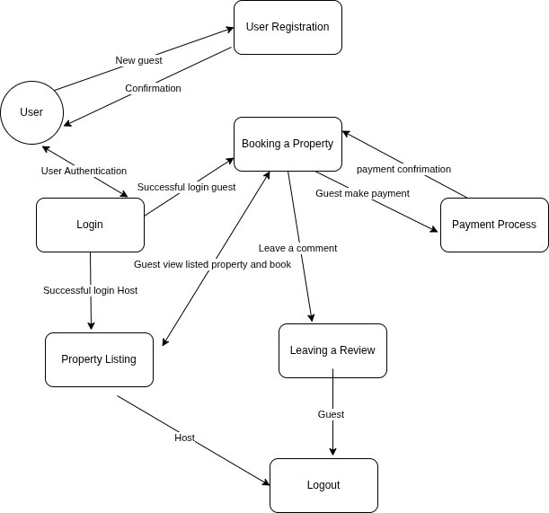
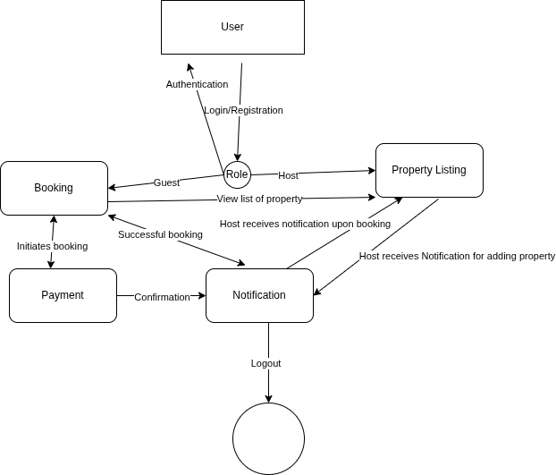
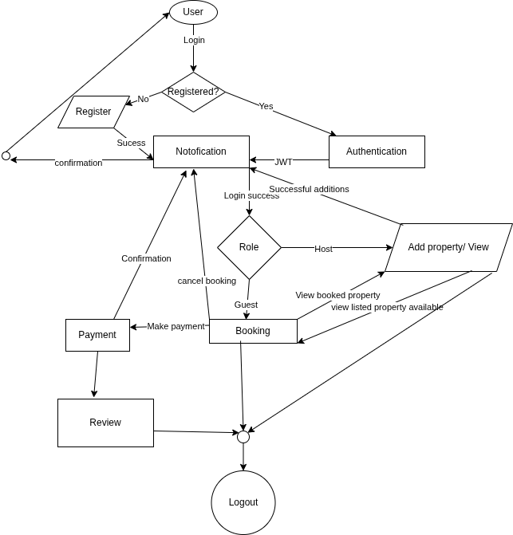

# ALX Airbnb Project Documentation

This repository contains the documentation and design artifacts for the backend of the **Airbnb Clone** project, including features, use case diagrams, data flows, flowcharts, user stories, and requirement specifications.

---

## 0. Documenting Project Features and Functionalities

**File:** `features-and-functionalities/features-and-functionalities.png`  
**Directory:** `features-and-functionalities/`

This diagram outlines the core backend features and functionalities the system must support:

- User Registration and Authentication  
- Property Listing and Management  
- Booking Functionality  
- Payment Integration  
- Review and Ratings System  
- Messaging Between Users  
- Notification System  
- Admin Controls and Moderation  
- Secure Access Control and Session Management  

## 1. Design the Use Case Diagram of the Features and Functionalities

**File:** `use-case-diagram/use-case-diagram.png`  
**Directory:** `use-case-diagram/`

This use case diagram visualizes the interactions between different actors and the system's key functionalities. It includes:

- **Actors:** Guest, Host, Admin  
- **Use Cases:** Register, Login, Add Property, Manage Bookings, Make Payment, Leave Review, Message Host, Get Notifications, Admin Approval

---

## 2. Convert Your Use Case Diagram to User Stories

**File:** `user-stories/user-stories.md`  
**Directory:** `user-stories/`

The user stories capture user-centered requirements based on the use case diagram. Examples include:

- As a guest, I want to register an account so I can book properties.  
- As a host, I want to list my property so guests can find and book it.  
- As a guest, I want to make secure payments so I can complete my booking.  
- As an admin, I want to review property listings to ensure quality control.  
- As a guest, I want to leave reviews so others can know my experience.

See all user stories in [`user-stories/user-stories.md`](user-stories/user-stories.md)

---

## 3. Design a Data Flow Diagram for Your Features and Functionalities

**File:** `data-flow-diagram/data-flow.png`  
**Directory:** `data-flow-diagram/`

This Data Flow Diagram (DFD) illustrates how data moves through the system's core modules, such as:

- **Inputs:** User credentials, property data, booking requests, payment info  
- **Processes:** Authentication, Booking Handler, Payment Processor  
- **Outputs:** Booking confirmation, payment status, notifications

---

## 4. Design a Flowchart for System Processes

**File:** `flowcharts/data-flow-diagram.png`  
**Directory:** `flowcharts/`

This flowchart maps out the steps involved in a core backend process, such as **User Registration and Authentication**:

- Input Validation → Check Existing Account → Create User → Hash Password → Store in DB → Send Confirmation → Login Redirect

